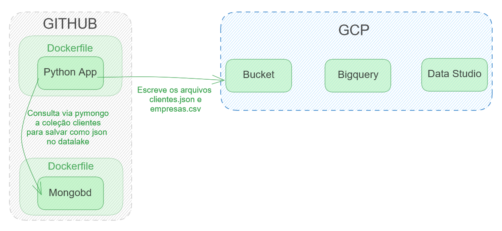
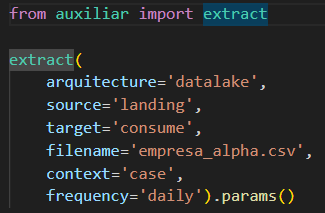
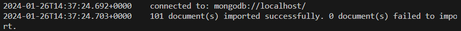
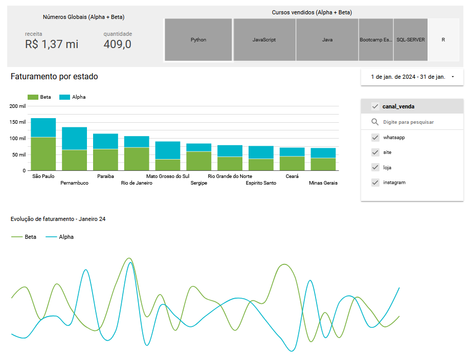

# Resumo do projeto
Nome do projeto no GCP: **Vendas-De**
Este projeto visa a criação de um projeto de engenharia de dados para analisar dados comerciais de duas empresas fictícias. Essas duas empresas (Alpha e Beta) vendem cursos na área de teconologia, e atuam no brasil todo, nas modalidades presencial e ead. Objetivo desse projeto é criar todo o pipeline de dados, desde a ingestão até a disponibilização.

# Arquitetura

A arquiquetura foi definida como:
* GCP - datalake
* Bigquery - Data Warehouse
* Data Studio - Visualização de dados
* Container - Docker
* Banco de Dados NOSQL - Mongo
* Banco de dados SQL - MySQL
* Scripts - Python

# Estrutura das pastas
Dentro da pasta GCP_DataEngineering temos as pastas:
### data_generator
Pasta que guarda scripts que criam os arquivos clientes.json, 
produtos_alpha.csv, produtos_beta.csv, vendas_alpha, vendas_beta.  
Clientes.py: gera uma base única de mil clientes que será usada para as duas empresas para fins de estudo.  
Produtos.py: Gera um arquivo com os produtos vendidos pelas duas empresas  
Vendas.py: Gera os dados das vendas de cada empresa, gerando dois arquivos (vendas_alpha, vendas_beta)

### elt_script
Esta pasta contém o script Python que carrega os dados para o bucket GCP, bem como carrega metadados[process_id;loaded_date;loaded_time;process_id;rows_count;from;to].
O arquivo **auxiliar.py** contém as classes utilizadas.  
**frequency**: Classe criada para a definição de estrutura de pastas no destino, de forma que podemos escolher salvar:  
    daily = yyyy/mm/dd/
    monthly = yyyy/mm/
    hourly = yyyy/mm/dd/hh  
**extract**: Classe desenvolvida para padronizar o script de carga de dados no bucket GCP, de forma que apenas seja preciso passar alguns parâmetros na chamada da função.   
***Exemplo de chamada da função***:  

O arquivo **elt.py** faz as chamadas das funções.

Ainda dentro da pasta GCP_Dataengineering, temos as pastas imagens (guarda as imagens usadas aqui no Readme) e sources (Guarda os arquivos usados como fonte para o estudo). 

# MongoDB Docker
Para gerar o arquivo usuarios em formato bson do Mongo

**montando a imagem mongo**  
docker build -t mongo:mongo .

**Executando container em segundo plano**  
docker run -d -p 27017:27017 mongo:mongo 

**caso queira checar detalhes da execução em segundo plano execute**  
docker ps ***para checar o id do container que está executando o mongo***

**Para criar a coleção clientes dentro do database vendas**   
docker exec -it {container_id} mongosh
docker exec -it f2996a225d18a49f9a3e3eea3a00462328b37be086c64a46e99c159656dd15b5 mongosh
use vendas
db.createCollection("clientes")

**para importar o clientes.json**  
Clique CTRL+C CTRL+D para sair da execução do mongosh e execute conforme a seguir:
docker exec -it f2996a225d18a49f9a3e3eea3a00462328b37be086c64a46e99c159656dd15b5 bash ***o container_id é informado assim que iniciada a execução em segundo plano***
mongoimport --db vendas --collection clientes --file clientes.json --jsonArray

Após completar as etapas você verá uma imagem como abaixo, indicando que o arquivo clientes.json foi carregado na coleção clientes.

Para checar a coleção, abra mais um terminal e execute:
* docker exec -it d61f6ea1de2f004986f13c006f9c45a5ffebfa371811e8b30b75688b6f7dd15e mongosh 
* use vendas
* db.clientes.find({})

# Looker  
Abaixo o relatório gerado na plataforma Looker. Esse relatório usa como fonte uma tabela gerada no Bigquery, que foi alimentada com uma tabela OBT das vendas de Janeiro na camada consume do datalake.

